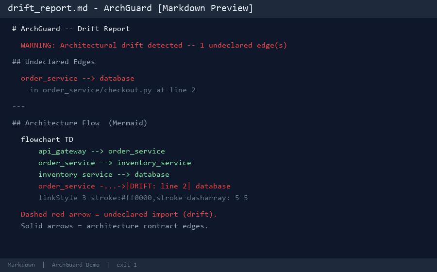
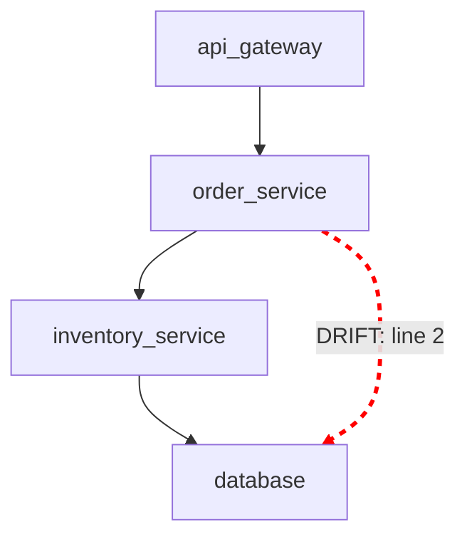
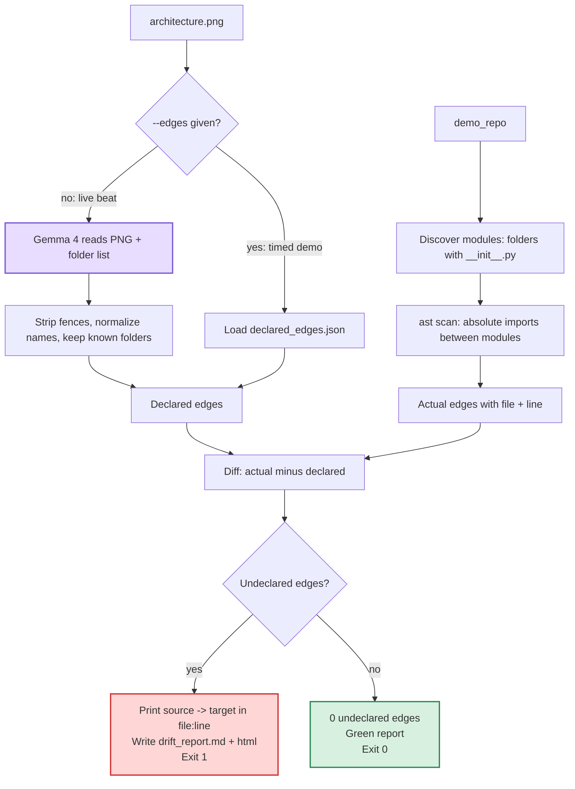

# ArchGuard

> **ArchGuard** checks whether Python package imports match the architecture documented by the repository's diagram. The diagram is the contract. Undeclared imports are drift.

[](LICENSE)

---

## Team

**Team Name:** Quantum\_Coders
**Event:** Hacktoberfest Hack Day · Amrita Coimbatore · INIT × iDEA × MLH · 8 Oct 2026

| Member | Role |
|---|---|
| Raghunathan B K | Team Lead — CLI, SKILL.md, integration |
| Kaevin P | Gemma 4 multimodal extraction |
| Viswanath A G | AST scanner, diff engine |
| Sanjay Siddhakumar | Demo repo, visualizer, README, GitHub |

---

## What is ArchGuard?

ArchGuard is a **visual architecture conformance linter**.

The architecture diagram (`architecture.png`) is the documented contract for the
codebase. ArchGuard extracts the directed edges from that diagram using **Gemma 4**,
then scans every Python source file with a deterministic **AST scanner** to find the
actual cross-module imports. Any import that exists in the code but is absent from
the diagram is reported as **architectural drift**.

---

## Problem

Architecture diagrams are created once and rarely updated. A senior engineer draws a
clean picture — `Billing → DataAccess → Database` — exports it as `architecture.png`,
and drops it in the README. The picture is the contract.

Then a pull request lands. Inside `billing/routes.py` someone writes a direct database
import. The app still runs. The boundary is gone. Nobody notices until the codebase is
a monolith nobody can draw anymore.

**Example:**

```
Diagram says:
    order_service → inventory_service

Code also contains:
    order_service → database   ← undeclared dependency
```

This direct database import was never drawn in the architecture diagram.
The codebase has drifted from its documented design.

Tools like Tach and import-linter exist for Python, but they require a hand-written
TOML or YAML contract that almost nobody maintains. **ArchGuard reads the PNG —**
the one contract the repo actually has.

---

## How It Works

```
architecture.png
      │
      ▼  Gemma 4 (multimodal visual extraction)
declared edges  ← or --edges declared_edges.json (offline)

Python source files
      │
      ▼  Python AST scanner (stdlib ast only)
actual imports  (file + line)

actual imports − declared edges
      │
      ▼
drift
      ├── terminal: file + line, exit 1 (drift) or exit 0 (clean)
      ├── drift_report.md   — Mermaid diagram, works offline in VS Code
      └── drift_report.html — red/green HTML summary
```

### Gemma 4's Role

Gemma 4 is used for **multimodal visual extraction of architecture edges from the
diagram**. It receives the PNG plus the list of top-level folder names and returns
only directed edges whose both ends are known module names.

Gemma 4 is **not** used to make the final drift decision. The diff is deterministic:
an edge is drift if and only if it appears in the scanned code and is absent from the
declared architecture graph.

### Deterministic Check

ArchGuard reports an edge as drift when:

> It exists in the scanned code **AND** is absent from the declared architecture graph.

Nothing else triggers a report. There is no speculation, no heuristic severity, and
no automatic fix.

---

## Demo Repository

The `demo_repo/` directory contains a minimal four-module Python system designed to
demonstrate architecture drift detection.

### Module structure

```
demo_repo/
├── architecture.png          ← the architecture contract
├── declared_edges.json       ← offline copy of the declared edges
├── api_gateway/
│   ├── __init__.py
│   └── router.py             ← imports order_service  (declared ✅)
├── order_service/
│   ├── __init__.py
│   └── checkout.py           ← imports inventory_service (declared ✅)
│                               imports database           (DRIFT ❌)
├── inventory_service/
│   ├── __init__.py
│   └── stock.py              ← imports database  (declared ✅)
└── database/
    ├── __init__.py
    └── connection.py         ← no outgoing imports
```

### Architecture diagram

The diagram declares exactly these three edges:

```
┌─────────────┐
│ api_gateway │
└──────┬──────┘
       │
       ▼
┌────────────────┐
│ order_service  │
└───────┬────────┘
        │
        ▼
┌────────────────────┐
│ inventory_service  │
└─────────┬──────────┘
          │
          ▼
     ┌──────────┐
     │ database │
     └──────────┘
```

### Planted drift

`demo_repo/order_service/checkout.py` line 2 contains:

```python
from database.connection import raw_sql_query   # DRIFT — not in diagram
```

This creates the undeclared edge `order_service → database`.
That edge is **not** present in `declared_edges.json` and is **not** drawn in
`architecture.png`. It is the single intentional drift in the demo.

---

## Drift Report Screenshot



*VS Code Markdown Preview of `drift_report.md` — the dashed red arrow is the undeclared `order_service → database` edge.*

---

## Running ArchGuard

### Prerequisites

- Python 3.11+
- No third-party packages required for the offline/demo run
- `Pillow` only needed to regenerate `architecture.png` (already committed)

### Installation

```bash
git clone https://github.com/<your-org>/Quantum_Coders-Hacktober-
cd Quantum_Coders-Hacktober-
```

No `pip install` required for the demo. All scanner logic uses Python stdlib (`ast`,
`pathlib`, `json`, `argparse`).

### Environment variables (live Gemma run only)

```bash
cp .env.example .env
# Edit .env and set GEMMA_API_KEY or GOOGLE_API_KEY
```

If you use the `--edges` flag (recommended for the demo), no API key is needed.

---

## Demo Commands

### Expected failure — drift detected

Run with the offline contract (no API key needed):

```bash
python -m archguard.cli check \
  --diagram demo_repo/architecture.png \
  --repo ./demo_repo \
  --edges demo_repo/declared_edges.json
```

**Expected output:**

```
⚠️  Architectural drift detected: 1 undeclared edge(s)
   ! order_service -> database in order_service/checkout.py:2

Reports generated: drift_report.md, drift_report.html
```

**Exit code: 1**

Open `drift_report.md` in VS Code Markdown Preview to see the Mermaid diagram with
the dashed red drift arrow:



### Expected pass — conformance after fix

Comment out or remove the planted import in `demo_repo/order_service/checkout.py`:

```python
# from database.connection import raw_sql_query   ← remove this line
```

Re-run the same command:

```bash
python -m archguard.cli check \
  --diagram demo_repo/architecture.png \
  --repo ./demo_repo \
  --edges demo_repo/declared_edges.json
```

**Expected output:**

```
✅ 0 undeclared edges. Codebase conforms 100% to architecture.png.
Reports generated: drift_report.md, drift_report.html
```

**Exit code: 0**

### Live Gemma 4 run (requires API key)

Install the optional live-extraction client first:

```bash
python -m pip install google-genai
```

```bash
python -m archguard.cli check \
  --diagram demo_repo/architecture.png \
  --repo ./demo_repo
```

Gemma 4 reads `architecture.png`, identifies the directed edges, and returns them as
structured JSON. The printed edges show the vision step in real time. The scanner and
diff then run identically.

---

## Project Architecture



---

## Limitations

- The scanner currently supports **Python only** (stdlib `ast`).
- It checks **top-level package import relationships** — it does not reconstruct the
  full runtime call graph.
- PNG visual extraction depends on **Gemma 4 multimodal interpretation** — label the
  diagram with exact folder names (not nicknames) for reliable extraction.
- The architecture diagram is treated as the **documented contract**. A missing arrow
  is reported as drift; it is not automatically classified as a forbidden boundary
  unless the diagram says so.
- ArchGuard **does not patch code** and does not suggest adapters or refactorings.

---

## Open Source and AI Usage

### AI / Models

- **Gemma 4 (open-weight, multimodal):** Visual extraction of architecture edges from
  `architecture.png`. Returns structured JSON; does not make the drift decision.

### Open Source Components

- **Python `ast` module (stdlib):** Deterministic source code import scanner.
- **Python `pathlib`, `json`, `argparse` (stdlib):** CLI and file handling.
- **Pillow:** Used only to generate `demo_repo/architecture.png`.

---

## Repository Structure

```
.
├── archguard/
│   ├── __init__.py
│   ├── cli.py              # CLI entry point
│   ├── dag_extractor.py    # Gemma 4 visual extraction
│   ├── ast_scanner.py      # Deterministic AST import scanner
│   ├── diff_engine.py      # Set difference: actual − declared
│   └── visualizer.py       # drift_report.md + drift_report.html
├── skills/
│   └── archguard/
│       └── SKILL.md        # Agent Skill Open Standard
├── demo_repo/
│   ├── architecture.png    # Four-box diagram (the contract)
│   ├── declared_edges.json # Offline contract copy
│   ├── api_gateway/
│   ├── order_service/      # Contains the planted drift
│   ├── inventory_service/
│   └── database/
├── .env.example            # Key names only — no secrets
├── .gitignore
├── LICENSE                 # MIT
└── README.md
```

The live extractor uses the optional `google-genai` package and reads the API key
from `GEMMA_API_KEY` or `GOOGLE_API_KEY`. Set `ARCHGUARD_MODEL` to override the
model name. The offline `--edges` path uses only the Python standard library and
does not contact the API.

When drift is found, the Markdown and HTML reports link each finding to its source
file and line. Use `--interactive` for an optional human decision prompt:

```bash
python -m archguard.cli check --repo ./demo_repo \
  --edges demo_repo/declared_edges.json --interactive
```

The prompt is diagnostic only. It never edits the source code, PNG, or edge
contract. CI remains non-interactive by default.

---

## Credits and License

### Credits

- Gemma 4 — Google DeepMind (open-weight multimodal model)
- Python `ast` — Python Software Foundation
- Pillow — Python Imaging Library contributors

### License

[MIT License](LICENSE) — Copyright © 2026 Raghunathan B K and Quantum\_Coders team.
