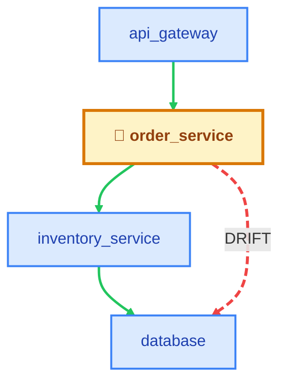

# ArchGuard Drift Report

## FAIL — 1 undeclared import

The code contains a dependency that is not declared in the architecture.

### Detected Drift

| Source | Target | File | Line |
|---|---|---|---:|
| `order_service` | `database` | [order_service/checkout.py](order_service/checkout.py#L2) | 2 |

### Architecture

Solid arrows = declared architecture. 
Red dashed arrows = undeclared code dependencies.

### Source Location

[order_service/checkout.py:2](order_service/checkout.py#L2)

Review each dependency and either correct the code or update the architecture contract if it is intentional.

